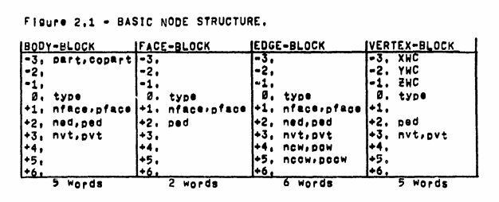

# Winged Edge BFEV
Winged Edge (BFEV) data structure implementation using the original "WINGED EDGE POLYHEDRON REPRESENTATION" paper from Baumgart, which can be found [here](http://www.dtic.mil/dtic/tr/fulltext/u2/755141.pdf).

Quote blocks are directly from the paper, reproduced for readability and easy reference.

## Relevant Excerpts

<!--
| WORD | BODY-BLOCK | FACE-BLOCK | EDGE-BLOCK | VERTEX-BLOCK |
| ---: | ---------- | ---------- | ---------- | ------------ |
| -3 | part, copart |              |              | XWC      |
| -2 |              |              |              | YWC      |
| -1 |              |              |              | ZWC      |
|  0 | type         | type         | type         | type     |
| +1 | nface, pface | nface, pface | nface, pface |          |
| +2 | ned, ped     | ped          | ned, ped     | ped      |
| +3 | nvt, pvt     |              | nvt, pvt     | nvt, pvt |
| +4 |              |              | ncw, pcw     |          |
| +5 |              |              | nccw, pccw   |          |
-->

### The Winged Edge Operations
Notes:
1. ***Q*** here is any ***BLOCK***, and ***A*** is "***A different EDGE***"
2. __FUNCTION.(X,Y)__ notation describes a setter function which somehow associates X with Y
    + e.g. __PVT(V,E)__ sets the ***pvt*** word of ***E*** to point to ***V*** )

#### Dynamic Storage Allocation

<pre>
DYNAMIC STORAGE ALLOCATION

  1. Q ← GETBLK(SIZE);
  2. RELBLK(Q, SIZE);
</pre>

> " At the very bottom, of what is becoming a rather deep nest of
    primitives within primitives, are the two dynamic storage allocation
    functions GETBLK and RELBLK. GETBLK allocates from 1 to 4K words of
    memory space in a contiguous block and returns the machine address of
    the first word of that block. RELBLK releases the indicated block to
    the available free memory space. (It is sad that the machines of our
    day do not come with dynamic free storage). A good reference for
    implementing such dynamic storage, mentioned earlier, is Knuth
    [reference 7]. Although a fixed block size of ten or fewer words can
    be made to handle the BFEV entities, grandiose and fickle research
    applications (as well as memory use optimization) demand the
    flexibility of a variable block size. "

#### BFEV Make & Kill Operations

<pre>
BFEV MAKE & KILL OPERATIONS

  1. BNEW ← MKB(B);		KLB(BNEW);
  2. FNEW ← MKF(B);		KLF(FNEW);
  3. ENEW ← MKE(B);		KLE(ENEW);
  4. VNEW ← MKV(B);		KLV(VNEW);
</pre>

> " Just above the free storage routines are the four pairs of
    make and kill operations. The MKB operation creates a body block and
    attaches it as a sub-part of the given body. The world body always
    exists so that MKB(WORLD) will make a body attached to the world. In
    this paper, the terms 'attach' and 'detach' refer to Operations on
    the parts-tree linkages. The FEV make operations: MKF, MKE, MKV
    create the corresponding FEV entitles and place them in their
    respective FEV rings of the given body. In the current
    implementation, the FEV makers set the type bits of the entity, and
    increment the proper total FEV Counter, as well as the proper body
    FEV counter in the given body's node, (the Fcnt, Ecnt, Vcnt node
    positions are shown in figure 2.3), The kill operations: KLB, KLF,
    KLE, and KLV; delete the entity from its ring (or remove it from the
    parts-tree), release its space by calling RELBLK, and then decrement
    the appropriate counters. The body of the entity is needed by the
    kill primitives and can be provide directly as an argument or if
    missing, will be found in the data by the primitive itself. "

#### Fetch Link and Store Link Operations

<pre>
FETCH LINK AND STORE LINK OPERATIONS

  1. F ← NFACE(Q);	F ← PFACE(Q);	NFACE.(F, Q);	PFACE.(F, Q);
  2. E ← NED(Q);		E ← PED(Q);		NED.(E, Q);		PED.(E, Q);
  3. V ← NVT(Q);		V ← PVT(Q);		NVT.(V, Q);		PVT.(V, Q);
  4. A ← NCW(E);		A ← PCW(E);		NCW.(A, E);		PCW.(A, E);
  5. A ← NCCW(E);		A ← PCCW(E);	NCCW.(A, E);	PCCW.(A, E);
</pre>

> " Each of the fetch link and store link operations named in the
    summary is a single machine instruction that accesses the
    corresponding link position in a node. Once BFEV nodes exist, with
    their rings and parts-tree already in place; the fetch and store link
    operations are used to construct or modify a polyhedron's surface, At
    this lowest level, constructing a polyhedron requires three steps:
    first the two vertex and two face pointers are placed into each edge
    in counter clockwise order as they appear when that edge is viewed
    from the exterior of the solid; second an edge pointer is placed in
    each face and vertex, so that one can later get from a given face or
    vertex to one of its edges; and third the edge wings are linked so
    that all the ordered perimeter accessing operations described below
    will work. Wing linking is facilitated by the WING operation. "

#### The Wing Link Operation

<pre>
WING LINK OPERATIONS

  1. WING(E1, E2);
  2. INVERT(E);
</pre>

> " The WING operation stores edge pointers into edges so that
    the face perimeters and vertex perimeters are made; and so that
    surface parity is preserved. Given two edges which have a vertex and
    a face in common, the WING operation places the first edge in the
    proper relationship (PCW, NCCW, NCW, or PCCW) with respect to the
    second, and the second In the proper relationship with respect to the
    first. The INVERT operation swaps the vertex, face, clockwise wing,
    and counter clockwise wing pointers of an edge. INVERT preserves
    surface parity, but flips edge parity "

#### Perimeter Fetch and Store Operations

<pre>
PERIMETER FETCH OPERATIONS

  1. E ← ECW(E, Q);
  2. E ← ECCW(E, Q);
  3. F ← FCW(E, V);
  4. F ← FCCW(E, V);
  5. V ← VCW(E, F);
  6. V ← VCCW(E, F);
  7. Q ← OTHER(E, Q);
</pre>

> " There are seven Perimeter fetch primitives, which when given
    an edge and one of its links will fetch another link in a certain
    fashion. Using the winged edge data structure these primitives are
    easily implemented in a few machine instructions which test the type
    bits and typically do one or two compares. Clockwise and counter
    clockwise are always determined from the outside of a polyhedron
    looking down on a particular face, edge or vertex. I apologize for
    the high redundancy on the next page, but felt that it was necessary
    to make the explanations independent for reference. "

##### The Perimeter Fetch Operations

`E ← ECW(E,F);` Get Edge Clockwise from E about F's perimeter. 
`E ← ECCW(E,F);` Get Edge Counter Clockwise from E about F's perimeter.
> " Given an edge and a face belonging to that edge, the ECW
    fetch primitive returns the next edge clockwise belonging to the
    given face's perimeter and the ECCW fetch primitive returns the next
    edge counter clockwise belonging to the given face's perimeter. "

`E ← ECW(E,V);` Get Edge Clockwise from E about V's perimeter. 
`E ← ECCW(E,V);` Get Edge Counter Clockwise from E about V's perimeter.
> " Given an edge and a vertex belonging to that edge, the ECW
    fetch primitive returns the next edge clockwise belonging to the
    given vertex's perimeter and the ECCW fetch primitive returns the
    next edge counter clockwise belonging to the given vertex's
    perimeter. "

`F ← FCW(E,V);` Get the face clockwise from E about V. 
`F ← FCCW(E,V);` Get the face counter clockwise from E about V.
> " Given an edge and a vertex belonging to that edge, the FCW
    fetch primitive returns the face clockwise from the given edge about
    the given vertex and the FCCW fetch primitive returns the face
    counter clockwise from the given edge about the given vertex. "

`V ← VCW(E,F);` Get the vertex clockwise from E about F. 
`V ← VCCW(E,F);` Get the vertex counter clockwise from E about F.
> " Given an edge and a face belonging to that edge, the VCW
    fetch primitive returns the vertex clockwise from the given edge
    about the given face and the VCCW fetch primitive returns the vertex
    counter clockwise from the given edge about the given face. "

`F ← OTHER(E,F);` Get the other face of an edge. 
`V ← OTHER(E,V);` Get the other vertex of an edge.
> " Given an edge and one face of that edge the OTHER fetch
    primitive returns the other face belonging to that edge. Given an
    edge and one vertex of that edge the OTHER fetch primitive returns
    the other vertex belonging to that edge. "

#### The Parts-Tree Operations

<pre>
PARTS TREE OPERATIONS.

  1. B ← PART(B);		B ← COPART(B);
  2. B ← BODY(B);		B ← SUPART(B);
  3. ATT(B1, B2);		ATTACH(B1, B2);
  4. DET(B);				DETACH(B);
</pre>

> " As shown in figure 2,1, each body node has two parts-tree
    links named PART and COPART. The PART link is the head of a list of
    sub-Parts of the body. When a body has no sub-parts the PART link is
    the negative of that body's pointer; that is the body Points at
    itself. When a body has parts, the first part is pointed at by PART
    and the second is pointed at by the COPART link of the first and so
    on until a negative pointer is retrieved which indicates the end of
    the parts list. The negative pointer at the end of a parts list
    points back to the original body, which is the supra-part or "supart"
    of all those bodies in that list. 
    " The parts may be accessed by its link names PART and COPART.
    Also the SUPART of a body returns the (positive) pointer to the
    supart of a body. The BODY operation returns the body to which a face
    edge or vertex belongs; this might be found by CDR'ing a FEV ring
    until a body node is reached, but for the sake of speed each edge (as
    shown in figure 2.3) has a PBODY link which points back to the body
    to which the edge belongs, and since each face and vertex points at
    an edge, the body of an FEV entity can be retrieved by fetching only
    one or two links. 
    " The parts-tree is altered by the DET(B) operation which
    removes a body B from its supart and leaves it hanging free; and the
    ATT(B1,B2) operation which places a free body B1 into the parts list
    of a body B2. Since bodies are made attached to the world body and
    generally kept attached to something, two further parts-tree
    operations are provided, compounding the first two in the necessary
    manner. The DETACH(B) operation DET's B from its current owner and
    ATT's it to the world; and the ATTACH(B1,B2) operation will DET B1
    from its supart and attach it to a new supart. In normal (one world)
    circumstances one only needs to use ATTACH to build things. "

### Primitives on Polyhedra

> " In this section a number of primitives for doing things to
    polyhedra are explained. Although these primitives are currently
    implemented using the winged edge data structure, they do not require
    a particular polyhedron representation. Indeed, many of these
    primitives were originally implemented in a LEAP polyhedron
    representation very similar to that of Falk, Feldman and Paul
    [reference 5]. Thus, the primitives of this section are on a level
    logically independent from the operations of the previous section. 
    " Another aspect of these primitives is that they can be used
    as the basis of a "graphics language" or more accurately as a package
    of subroutines for geometric modeling. In this vein, the primitives
    are currently collected as a package called GEOMES for Geometric
    Modeling Embedded in SAIL; and as GEOMEL, Geometric Modeling Embedded
    in LISP. A third language, called GEOMED, arises out of the command
    language of a geometric model editor based on the primitives. 
    " The primitives are shown in four groups in the summary. The
    first group, the Euler Primitives, were Inspired by Coxeter's proof
    of Euler's formula, section 10.3 of [reference 2]. Although the proof
    only required three primitives, additional ones of the same ilk were
    developed for convenience. The second group is composed of some
    polyhedron primitives that were coded using the Euler primitives. The
    third group is for primitives that move bodies, faces, edges and
    vertices; or compute geometric values such as length and volume, This
    group is underdeveloped for two reasons: one, because I have done
    these computations ad hoc to date; and two, because they imply the
    subject of animation which is large and difficult and not of central
    importance to vision. With the exception of the camera, my worlds are
    nearly (but not absolutely) static. A less impoverished geometric
    group will be presented in the future. The final group, has three
    well developed primitives for making 2D images; and several
    primitives that when finished will realize part of the vision system
    that I am trying to build. "

#### Euler Primitives

<pre>
A. EULER PRIMITIVES

   1. BNEW 	← MKBFV;			 	 make a body, face & vertex.
   2. KLBFEV(Q); 						 kill a body & all its pieces.
   3. VNEW 	← MKEV(F,V); 		 make edge & vertex.
   4. ENEW 	← MKFE(V1,F,V2); make face & edge.
   5. VNEW 	← ESPLIT(E); 		 split an edge.
   6. F			← KLFE(ENEW); 	 kill face & edge leaving a face.
   7. E 		← KLEV(VNEW); 	 kill edge & Vertex leaving an edge.
   8. V 		← KLVE(ENEW); 	 kill vertex & edge leaving a vertex.
   9. B 		← GLUE(F1,F2); 	 glue two faces together.
  10. PNEW 	← UNGLUE(E); 		 unglue along a seam containing E.
</pre>

> " As mention above, the Euler Primitives are based on the Euler
    Equation `F-E+V = 2*B-2*H;` where F, E, V, B and H stand for the number
    of faces, edges, vertices, bodies and handles that exist. The term
    "handle" comes from topology, and is the number of well formed holes
    in a surface; a sphere has no handles, a torus has one handle, and an
    IBM flowcharting template has 26 handles. The Euler equation
    restricts the possible topologies of FEV graphs that can be
    polyhedra; although such Eulerian polyhedra do not necessarily
    correspond to what we normally call a solid classical polyhedron.
    Strict adherence to constructing a polyhedron that satisfies Euler
    equation `F - E + V = 2*B - 2*H` would require only four primitives; "

<pre>
																		+F -E +V = 2*B - 2*H
1. 	Make Body, Face and Vertex 			+1....+1....+1......
2. 	Make Edge and Vertex. 					...-1 +1............
3. 	Make Face and Edge. 						+1 -1...............
4. 	Glue two faces of one body. 		-2 +N -N............
4.' Glue two faces of two bodies. 	-2 +N -N....-1......
</pre>

> " However, the four corresponding destructive primitives are also
    possible and desirable:

<pre>
																		+F -E +V = 2*B - 2*H
1. 	Kill Body, Face and Vertex			+1....+1....+1......
2. 	Kill Edge and Vertex. 					...-1 +1............
3. 	Kill Face and Edge. 						+1 -1...............
4. 	Unglue along a seam. 						-2 +N -N..........-1
4.' Unglue along a seam. 						-2 +N -N....-1......
</pre>

> " And finally the operation of splitting an edge at a midpoint into two
    edges became so important in forming T-Joints during hidden line
    elimination that the ESPLIT primitive was Introduced in place of the
    equivalent KLFE, MKEV, MKFE sequence. 
    " In using the Euler primitives, some non-classical polyhedra
    are tolerated as transitional states of the construction; these
    transitional states are called:
<pre>
		Seminal Polyhedron,
    Wire Polyhedron.
    Lamina Polyhedron.
    Shell Polyhedron.
    Face with Wire Spurs on its perimeter.
</pre>
>   A seminal polyhedron is like a point; a wire polyhedron is linear
    with two ends like a single piece of wire; lamina and shell polyhedra
    are surfaces, and the picturesque phrase about spurs is a restriction
    on how faces are dissected into more faces. These terms will be
    explained in more detail when they are needed. "

`BNEW ← MKBFV;` Make Seminal Body.
> " The MKBFV primitive returns a body with one face and one
    vertex and no edges. Other bodies are formed by applying primitives
    to the seminal MKBFV body. The seminal body is initially attached as
    a part of the world. "

`KLBFEV(BNEW);` Kill Body and all its pieces.
> " The KLBFEV primitive will detach and delete from memory the
    body given as an argument as well as all its faces, edges, vertices
    and sub-parts. "

`VNEW ← MKEV(F,V);` Make an edge and a vertex.
> " The MKEV primitive takes a face, F, and a vertex, V, of F's
    perimeter and it creates a new edge, ENEW, and a new vertex, VNEW.
    ENEW and VNEW are called a "wire spur" at V on F. MKEV returns the
    newly made vertex, VNEW; ENEW can be reached since PED(VNEW) is always ENEW. Only one wire spur is allowed at V on F at a time. 
    " When applied to the face of a seminal body, MKEV forms the
    special polyhedron called a "wire" and returns the new vertex as the
    "negative" end of the wire. A wire polyhedron is illustrated in
    figure 3.1. When applied to the negative end of a wire, MKEV extends
    the wire: however if applied to any other vertex of the wire, MKEV
    refuses to change anything and merely returns its vertex argument. "

<pre>
Figure 3.1 - A Wire Polyhedron. 				Figure 3.2 - VNEW ← MKEV(F,V);

	 seminal vertex  ● V1 													+V
	 positive end   +|  of wire.										/|\
									 | E1													 / |←←←←ENEW spur.
									-|														/  |  \
									 ● V2												 / -VNEW \
									+|													/					\
									 | E2											 /		 F		 \
	 negative end   -|  of wire.							/							\
	 latest vertex   ● V3										 ●---------------●
</pre>

`ENEW ← MKFE(V1,F,V2);`
> " The MKFE primitive can be thought of as a face split. Given
    a face and two of its vertices, MKFE forms a new face on the
    clockwise side of the line V1 to V2 leaving the old face on the
    counter clockwise side. V1 becomes the PVT of ENEW, V2 becomes the
    NVT of ENEW, F becomes the PFACE of ENEW and FNEW becomes the NFACE
    of ENEW; also ENEW becomes the PED of F and FNEW. "

<pre>
Figure 3.3 - MKFE and KLFE.

		 BEFORE MKFE					 AFTER ENEW MKFE(V1,F,V2)
      ●				●										●				●
		 / \		 / \								 / \		 / \
		/		\		/		\								/		\		/		\
	 /		 \ /		 \						 /		 \ /		 \
	/				● 			\						/			 +V1			\
 /								 \				 / -FNEW	|		+F	 \
●					F					●				●					|←←←ENEW	●
 \								 /				 \				|				 /
	\				●				/						\			 -V2			/
	 \		 / \		 /						 \		 / \		 /
		\		/		\		/								\		/		\		/
		 \ /		 \ /								 \ /		 \ /
      ●				●										●				●
  AFTER F←KLFE(ENEW);						 BEFORE KLFE
</pre>

> " MKFE is also used to join the two ends of a wire polyhedron
    to form a "lamina"; or the two ends of wire spurs to split a face; or
    an end of a wire spur and a regular perimeter vertex to split a face.
    A "lamina polyhedron" has only two faces and thus no volume. "

##### Euler Examples
> " The use of the primitives discussed so far is illustrated by
    the example subroutines in figure 3.4 on page 29. The make cube
    subroutine starts by placing a seminal vertex at (1,1,1); Then a wire
    of three edges is made using the MKEV primitive. As the code implies,
    MKEV places its new vertex at the locus of the old one. The ends of
    the wire are joined with a MKFE to form a lamina polyhedron, then a
    spur is placed on each of the vertices of the lamina, and finally the
    spurs are joined. 
    " The pyramid example is more realistic, since polyhedra are
    not generated ex nihil, but rather arise out of the vision routines
    and the geometric editor. PYRAMID takes a face as an argument (which
    is assumed to have no spurs) and runs a spur from one vertex to the
    middle of the faces, then all the remaining vertices of the face are
    joined to that spur to form a pyramid. "

`V ← ESPLIT(E);` Edge Split.
> " This primitive splits an edge by making a new vertex and a
    new edge. Its implementation is very similar to the midpoint example
    on page 19. ESPLIT is heavily used in the hidden line eliminator. "

`F ← KLFE(E.EW);` Kill Face Edge.
> " This primitive kills a face and an edge leaving one face.
    Since this primitive is intended to be an inverse of MKFE, the NFACE
    of ENEW is killed. However the NFACE and PFACE of an edge may be
    swapped by using the INVERT(E) primitive. See Figure 3.3 for KLFE. "

`E ← KLEV(VNEW);` Kill Edge Vertex.
> " This primitive kills an edge and a vertex leaving one edge.
    This primitive will eliminate spurs made with MKEV and midpoints made
    with ESPLIT; in a pure form it would have to leave vertices with a
    valence greater than two untouched, however it in face "un-pyramids"
    them with a series of KLFE's and then kills the remaining spur.

`V ← KLVE(ENEW);` Kill Vertex Edge.
> " This primitive kills a vertex and an edge leaving one vertex.
    This primitive is the face-vertex dual of KLFE, namely instead of
    killing NFACE of E and fixing up PFACE's perimeter, KLEV kills the
    NVT of E and fixes up PVT of E's perimeter.

`B ← GLUE(F1,F2);` Glue two faces.
> " This primitive glues two faces together forming once new body
    out of two old ones (the body of F1 survives) or forming a handle on
    the given body. The number of edges in the two faces must be the same
    and their orientation should be opposite (exterior to exterior).

`BNEW ← UNGLUE(E);` Unglue along seam. \*not implemented.
> " This primitive unglues along the seam containing E. The
    UNGLUE primitive requires that a loop of edges be marked as a "seam"
    along which unglue will form two opposite faces. The marks are made
    in the temporary type bit in the edge nodes of the given body. If
    the cut forms two disjoint bodies then a new body is made on the
    NFACE side of the original E argument. "
